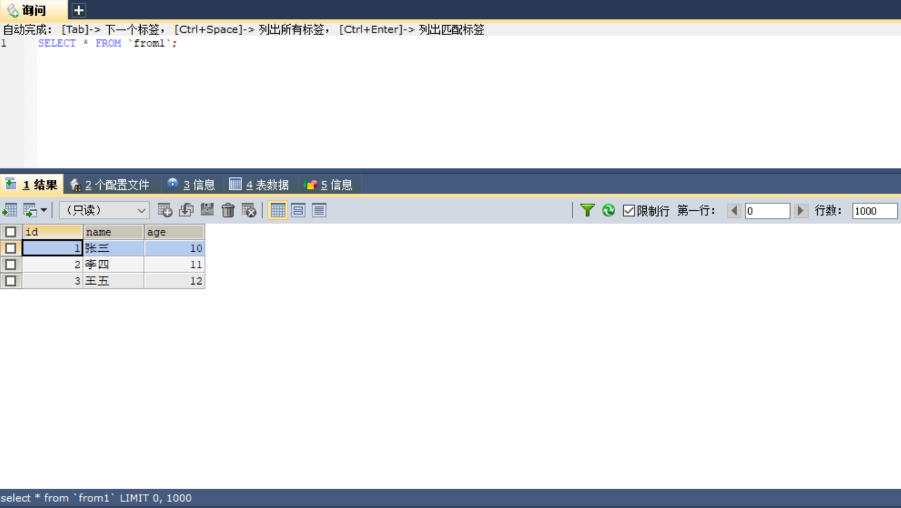
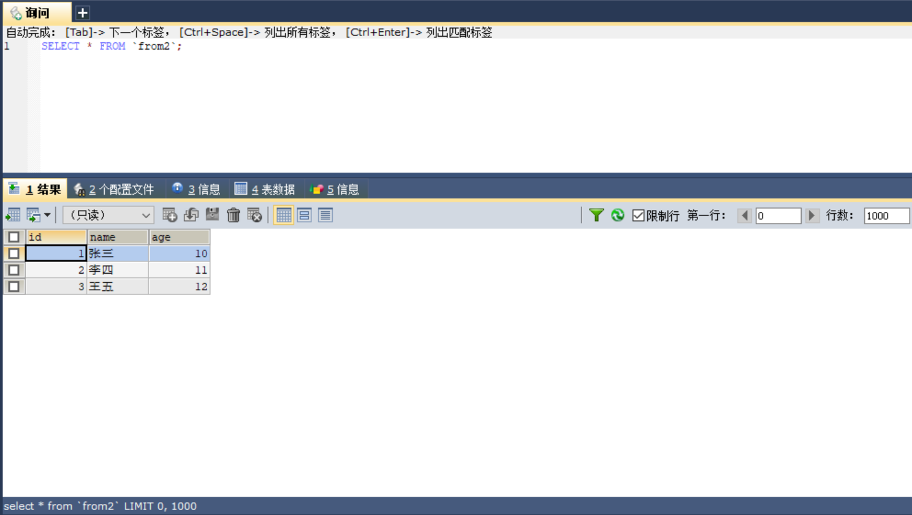
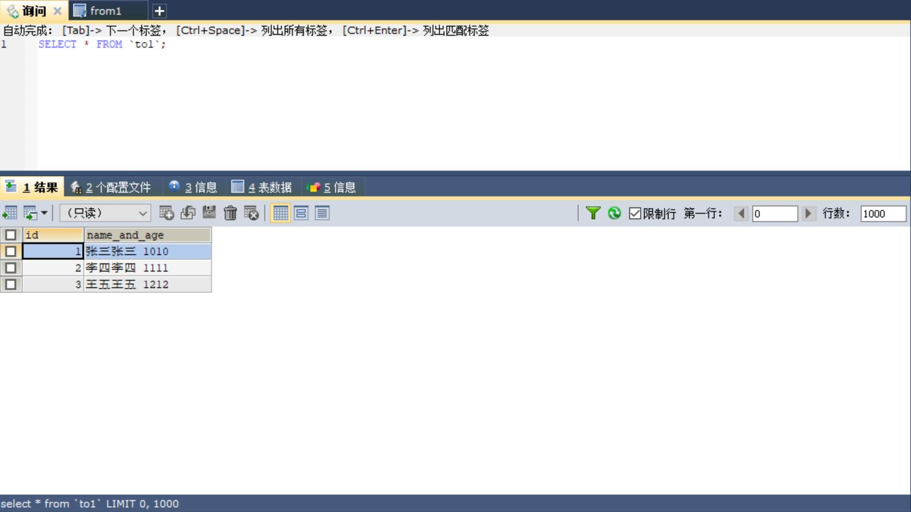

# 一眼订正：快速完成*数据订正*的脚手架

## 它能干嘛

一眼订正是一款上手极其简单的数据订正脚手架，旨在帮助大家解决在项目版本迭代
过程中导致表结构发生变化而编写大量 SQL 的麻烦。除此之外，如果订正逻辑还掺
杂了业务逻辑，那么光是靠编写 SQL 是难以实现的。为了解决这个痛点，一眼订正
完全支持以配置的形式完成订正，并且考虑到大家以及离不开 Spring Boot 开发
，一眼订正将结合启动类完成操作。

一眼订正有如下几个重要功能：

* **手动配置**

  它将让您感受到如同配置 Spring Cloud Gateway 网关一样，上手极其容易，
  并且不需要任何学习成本

* **优美地设置订正逻辑**

  它将完全与配置类进行解耦，我们不需要担心在配置中出现大量冗余且复杂的代
  码，您只需要继承 Logic 类就好

## 快速开始

让您非常简单地开始尝试数据订正

由于 core 模块中已经将 DB 版本写死，所以不建议大家从 Maven 中心
仓库中拉取依赖，推荐如下操作：

### 第一步：下载项目

* 下载 [zip](https://git.zhonganinfo.com/wuhaixin/datacorrection/-/archive/master/datacorrection-master.zip)
* 从 git 仓库拉取
  ```git
  https://github.com/RovingSea/glance-correction.git
  ```

### 第二步：编写相关的 DB 映射实体类

例如 MySQL 中有两张来源表 from1、from2；目标表 to1；
所以您编写三个实体类，From1、From2、To1，属性与 DB 字段
对应。

### 第三步：编写 DAO

建议使用 Mybatis 通过 Mapper 获取，这样更加方便，当然您
如果有别的方式获取来源表的数据也是可以的，但是要求您最后是
以链表存储这些数据。

### 第四步：编写订正逻辑

请继承 Logic 抽象类，完成从来源表到目标表的逻辑转换。

参考如下：

  ```java
  /**
   * 将来源表 from1 和 from2 的 name 字段 和 age 字段组合相加
   * 作为 to1 表的 name 字段
   */
  public class NameAndAgeLogic extends Logic {
    @Override
    public void set(Map<Class<?>, ?> sourceDataClass, Object targetObject) {
      From1 from1 = (From1) sourceDataClass.get(From1.class);
      From2 from2 = (From2) sourceDataClass.get(From2.class);
      To1 to1 = (To1) targetObject;
  
      to1.setNameAndAge(from1.getName() + from2.getName() + " " + from1.getAge() + from2.getAge());
    }
  }
  ```

### 第五步：设置订正配置

请实现 CorrectionConfiguration 接口，并为实现类添加
@Configuration 注解，以及实现的方法添加 @Bean 注解，
为避免 beanName 冲突，建议为 @Bean 注解设置 name 属性。

参考如下：

  ```java
  @Configuration
  public class SampleCorrectionConfiguration implements CorrectionConfiguration {
    
    @Autowired
    private From1Mapper from1Mapper;
  
    @Autowired
    private From2Mapper from2Mapper;
  
    @Bean(name = "to1")
    @Override
    public CorrectionLoader setConfiguration(CorrectionLoaderBuilder builder) {
      QueryWrapper<From1> queryWrapper1 = new QueryWrapper<>();
      queryWrapper1.last("limit 0,10");
      QueryWrapper<From2> queryWrapper2 = new QueryWrapper<>();
      queryWrapper2.last("limit 0,10");
  
      return builder.corrections()
              .correction(c -> c
                      .mysql()
                      .sourceDataClass(From1.class)
                      .data(from1Mapper.selectList(queryWrapper1))
                      .sourceDataClass(From2.class)
                      .data(from2Mapper.selectList(queryWrapper2))
                      .targetDataClass(To1.class)
                      .column("name_and_age", new NameAndAgeLogic()))
              .build();
    }
  }
  ```

### 第六步：启动订正

启动 Spring boot，从容器中获取 CorrectionBoot 对象，并启动

参考如下：

  ```java
  @SpringBootApplication
  public class SampleApplication {
    public static void main(String[] args) {
      CorrectionBoot correctionBoot =
              SpringApplication.run(SampleApplication.class, args).getBean(CorrectionBoot.class);
      correctionBoot.boot();
    }
  }
  ```

### 第七步：效果展示
#### 来源表from1数据

#### 来源表from2数据

#### 订正后的目标表to1数据


## 帮助文档

* 使用案例见：[使用案例](https://github.com/RovingSea/glance-correction/tree/develop/glance-correction-sample)
* 设计思路见：[设计文档](设计文档.md)
* 更多使用详情见：[使用文档](使用文档.md)

  