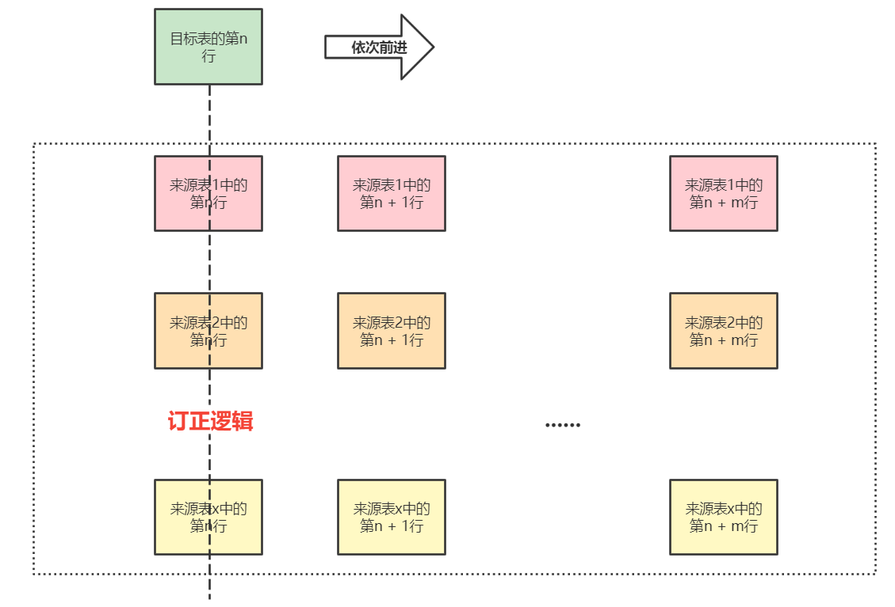

一眼订正的设计思路百分之七十参考了 Spring Cloud Gateway 的设计思路，
通过结合 Spring IOC 机制进行对 bean 的一系列管理，两个容器通过 core 模块
中的 spring.factories 进行 SPI

# 整体流程

主要可以分为两大步：设置配置和执行订正
## 设置配置
* 设置数据源类型，比如 MySQL 等数据库
* 设置来源表映射类（From1.class）和来源数据(List< From1>)
* 设置目标表映射类（To1.class）
* 设置转化为目标表的每一列的逻辑

## 执行订正
* 启动订正启动器（CorrectionBoot）
* 通过订正加载器（CorrectionLoader），获取所有订正集（List< Correction>）
* 为每一种订正生成一个订正执行器（CorrectionExecutor）
* 订正执行器执行前*记录来源表在当前标记位的所有数据*， 这个说法好像有点读不懂，可以参考下图：
  
* 订正执行器生成目标表代理对象，通过执行订正逻辑链（LogicChain）为这个代理对象赋值
* 订正执行器执行*订正环绕处理器*（ExecutionAroundProcessor）
* 订正环绕处理器持有订正执行器中的数据库连接对象，可以进行重写，默认是直接插入

